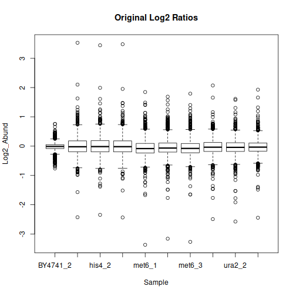
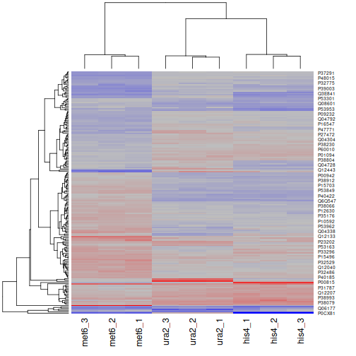

# isobarc-prot-wf-r
Simple workflow for the isobaric-labeling proteomic data with ANOVA and T-testing


See the main highlights below:
```r
#library(readxl)
library(dplyr)
library(ggplot2)
library(tidyr)
```
Select the work directory and import the protein table.
<br>The example data originates from the analysis of the commercial yeast [triple-knockout (TKO) TMT standard](https://www.thermofisher.com/order/catalog/product/A40938#/A40938)
<br>

```r
#Set the working directory for the project
setwd("/home/trainee/Documents/R/Yeast_TKO/")
#If the table has been exported as a tab-separated text file
all_proteins <- read.table("MS3_FAIMS_Proteins_PD24.txt", sep = '\t', header = TRUE)
#If the table is in Excel format
#all_proteins <- read_excel("MS3_FAIMS_Proteins_PD24.xlsx")
```

```r
dim(all_proteins)
```

```
## [1] 1904   51
```

The quantitative columns (abundance ratio columns) are extracted and renamed:
```r
res <- rename_ratios(all_proteins)
all_proteins <- res[[1]]
quan_columns <- res[[2]]
quan_columns
```

```
##  [1] "BY4741_2" "his4_1"   "his4_2"   "his4_3"   "met6_1"   "met6_2"   "met6_3"   "ura2_1"   "ura2_2"   "ura2_3"
```

After several stages of filtering, we prepare a "wide" table with quantitative values, as well as the "long", tidy version:

```r
dfWide <- all_proteins %>%
  filter(!grepl("cont_",Accession)) %>%
  subset (select=c("Accession", quan_columns) ) %>%
  na.omit()

dfLong <- gather(dfWide, Sample, RelAbund, -Accession)
dfLong = mutate(dfLong, log2Abund = log2(RelAbund))

rownames(dfWide) <- dfWide$Accession
dfWide$Accession <- NULL
dfWide <- log2(dfWide)
head(dfWide)
```

```
##           BY4741_2      his4_1     his4_2      his4_3      met6_1      met6_2      met6_3      ura2_1      ura2_2      ura2_3
## P40079 -0.02180437  0.12300395  0.2678354  0.15185882 -0.16974468 -0.26188071 -0.14401030  0.03562391  0.22774108  0.27500705
## P27680  0.24245007  0.31034012  0.2028878  0.54892977 -0.02767496 -0.25325728 -0.18935125  0.09761080 -0.06039728 -0.04394335
## Q06336 -0.06793883  0.13750352  0.3628906 -0.36959453  0.09491165 -0.20091269 -0.24468510  0.10299399 -0.28982725 -0.13764780
## P39704  0.06763872 -0.11403524 -0.1552126 -0.06793883 -0.29512804 -0.11091590  0.02715405 -0.13606155 -0.48398485 -0.05139915
## P27999 -0.03504695  0.15962919  0.3184615  0.30917619 -0.18278608 -0.04543143 -0.26015190 -0.03356953 -0.08314124  0.02998287
## P46955 -0.10935876  0.09085343  0.0229004  0.42545930 -0.07248275 -0.35845397 -0.31114826 -0.04841221 -0.26534457  0.10567808
```

```r
dfLong$Group <- apply(
  dfLong, 1, function(x) {
    sampleName <- x["Sample"]
    #OBS: format-dependent operations
    strsplit(sampleName, "_")[[1]][[1]]
  }
)
head(dfLong)
```

```
##   Accession   Sample RelAbund   log2Abund  Group
## 1    P40079 BY4741_2    0.985 -0.02180437 BY4741
## 2    P27680 BY4741_2    1.183  0.24245007 BY4741
## 3    Q06336 BY4741_2    0.954 -0.06793883 BY4741
## 4    P39704 BY4741_2    1.048  0.06763872 BY4741
## 5    P27999 BY4741_2    0.976 -0.03504695 BY4741
## 6    P46955 BY4741_2    0.927 -0.10935876 BY4741
```

Look at the pronciple component analysis on the samples:
```r
dfWide.t <-  t(dfWide)
dfWide.pca <- prcomp(dfWide.t, center = TRUE, scale. = FALSE)
summary(dfWide.pca)
```

```
## Importance of components:
##                           PC1    PC2    PC3     PC4     PC5     PC6     PC7     PC8     PC9      PC10
## Standard deviation     4.8331 3.8904 2.8461 1.78095 1.61699 1.54019 1.51172 1.40449 1.36241 1.646e-15
## Proportion of Variance 0.3838 0.2487 0.1331 0.05211 0.04296 0.03897 0.03755 0.03241 0.03049 0.000e+00
## Cumulative Proportion  0.3838 0.6324 0.7655 0.81762 0.86058 0.89955 0.93710 0.96951 1.00000 1.000e+00
```

```r
dfWide.pca <- as.data.frame(dfWide.pca$x)
dfWide.pca$Group <- sapply(
  as.character( row.names(dfWide.pca) ),
  function(x) {
    strsplit(x, "_")[[1]][[1]]
  }
)
#Principal components 1 and 2
ggplot(
  dfWide.pca,
  aes(x = PC1, y = PC2, colour = Group )
  ) +
  geom_point(shape=19, size=4, alpha = 0.7)+
  geom_hline(yintercept = 0, colour = "gray65") +
  geom_vline(xintercept = 0, colour = "gray65") +
  ggtitle("PCA On Proteins") +
  theme_classic()
```




```r
#Pairwise scatter plots
#Consider this for the tables of the moderate size
#This is probably not suitable for datasets with many dozens of samples
#For those, use the correlation heatmap
panel.cor <- function(x, y){
  usr <- par("usr"); on.exit(par(usr))
  par(usr = c(0, 1, 0, 1))
  r <- round(cor(x, y), digits=2)
  txt <- paste0("R = ", r)
  cex.cor <- 0.8/strwidth(txt)
  text(0.5, 0.5, txt)
}
upper.panel<-function(x, y){
  points(x,y, pch = 19, cex = 0.4, col = alpha("blue", 0.2))
}
pairs(dfWide, lower.panel = panel.cor, upper.panel = upper.panel,
      main = "Correlations on Proteins")
```


```r
#Calculate one-way ANOVA P-values
dfANOVA <- dfWide
cols_anova <- c("his4_1", "his4_2", "his4_3", "met6_1", "met6_2", "met6_3", "ura2_1", "ura2_2", "ura2_3")
#Create the named list with our groups
groups <- list()
for (i in cols_anova) {
  local_name <- strsplit(i, "_")[[1]][[1]]
  if ( local_name %in% names(groups) ) {
    groups[[local_name]] <- c(groups[[local_name]], i)
  } else {
    groups[[local_name]] <- c(i)
  }
}
groups
```

```
## $his4
## [1] "his4_1" "his4_2" "his4_3"
## 
## $met6
## [1] "met6_1" "met6_2" "met6_3"
## 
## $ura2
## [1] "ura2_1" "ura2_2" "ura2_3"
```

```r
dfANOVA$anovaPval <- apply(dfANOVA, 1, function(x) {
  df <- as.data.frame(x)
  #Select the samples for ANOVA
  #Important if you need to exclude some of the samples from the calculation
  #cols_anova <- c("his4_1", "his4_2", "his4_3", "met6_1", "met6_2", "met6_3", "ura2_1", "ura2_2", "ura2_3")
  df$Sample <- rownames(df)
  df <- df[ df$Sample %in% cols_anova, ]
  
  #Define groups in sync with the selected columns
  #OBS: format-dependent
  df$Group <- as.vector(
    sapply(
      cols_anova,
      function(x) { strsplit(x, "_")[[1]][[1]] }
      )
    )
  anovaResults <- aov(x ~ Group, data = df)
  #This Very exciting expression is how to extract the p-value from the aov summary
  return(summary(anovaResults)[[1]]["Pr(>F)"][[1]][[1]])
})
#Benjamini-Hochberg correction for multiple testing
dfANOVA$adjPval <- p.adjust(dfANOVA$anovaPval, method = "BH")
#Add group averages
for ( i in names(groups) ) {
  dfANOVA[i] <- apply(
    dfANOVA, 1, function(x) {
      #print(x)
      #print(typeof(x))
      mean( x[ groups[[i]] ] )
    }
  )
}
#Add max LogFC
dfANOVA$MaxLog2FC <- apply(
  dfANOVA, 1, function(x) {
    log_means <- x[ names(groups) ]
    max(log_means) - min(log_means)
  }
)

#Filter on adjusted p-value and minimal fold-change
print("Proteins with adjusted ANOVA P <= 0.01 and FC > log2(1.5) [50%]")
```

```
## [1] "Proteins with adjusted ANOVA P <= 0.01 and FC > log2(1.5) [50%]"
```

```r
dfANOVA.Sign <- dfANOVA %>%
  filter(adjPval <= 0.01 & MaxLog2FC >= log2(1.5) ) %>%
  select(cols_anova)
```

```
## Note: Using an external vector in selections is ambiguous.
## ℹ Use `all_of(cols_anova)` instead of `cols_anova` to silence this message.
## ℹ See <https://tidyselect.r-lib.org/reference/faq-external-vector.html>.
## This message is displayed once per session.
```

```r
dim(dfANOVA.Sign)
```

```
## [1] 67  9
```

```r
heatmap(
  as.matrix( dfANOVA.Sign ), scale = "none",
  col = colorRampPalette(c("red", "grey", "blue"))(256)
)
```


```r
calc_ttest <- function(df, groupping, gr1, gr2, maxAdjP, minFC) {
  df <- df[ c( groupping[[gr1]], groupping[[gr2]]  ) ]
  #Log2 fold change group2 - group1
  df$Log2FC <- apply(
    df, 1, function(x) {
      mean( x[ groupping[[gr2]] ] ) - mean( x[ groupping[[gr1]] ] )
    }
  )
  #T-test with equal variance
  df$T_Pval <- apply(
    df, 1, function(x) {
      res <- t.test(
        x[ groupping[[gr2]] ], x[ groupping[[gr1]] ],
        alternative = "two.sided", var.equal = TRUE
        )
      mean( x[ groupping[[gr2]] ] ) - mean( x[ groupping[[gr1]] ] )
      res$p.value
    }
  )
  #Benjamini-Hochberg correction for multiple testing
  df$adjPval <- p.adjust(df$T_Pval, method = "BH")
  df$Log10adjPval <- -1*log10(df$adjPval)
  #Add the categorical column
  df$Diff_Abund <- apply(
    df, 1, function(x) {
      if (x[["adjPval"]] <= maxAdjP & x[["Log2FC"]] >= minFC) {
        return( paste("Up in", gr2) )
      } else if (x[["adjPval"]] <= maxAdjP & x[["Log2FC"]] <= -1*minFC) {
        return( paste("Up in", gr1) )
      } else {
        return('Non-significant')
      }
    }
  )
  df
}
maxAdjP <- 0.05
minLog2FC <- round(log2(1.4), 3)
gr1 <- "met6"
gr2 <- "ura2"
df_met_his <- calc_ttest(dfWide, groups, gr1, gr2, maxAdjP, minLog2FC )

df_met_his <- merge(
  df_met_his, all_proteins,
  by.x="row.names", by.y="Accession",
  suffixes=c("", "_"), sort=FALSE
  )

#Volcano plot
ggplot(
  df_met_his,
  aes(x = Log2FC, y = Log10adjPval, colour = Diff_Abund )
) +
  geom_point(shape=19, size=2, alpha = 0.6)+
  geom_hline(yintercept = -1*log10(maxAdjP), colour = "gray65") +
  geom_vline(xintercept = 0, colour = "gray65") +
  geom_vline(xintercept = -1*minLog2FC, colour = "gray65") +
  geom_vline(xintercept = minLog2FC, colour = "gray65") +
  ggtitle(
    paste(
      "T-test ", gr1, " vs ", gr2,
      " Adjusted P-value<=", maxAdjP, " Log2 FC>=", minLog2FC,
      sep=""
      )
    ) +
  theme_classic() +
  theme(
    legend.title = element_blank(), legend.text = element_text(size=12),
    plot.title = element_text(size=16)
    ) +
  labs(x = paste("Log2 FC", gr2, "-", gr1), y = "-Log10 Adj. P-value" ) +
  geom_text(
    data = subset(df_met_his, Log2FC >=0.9 | Log2FC <= -0.8),
    aes( Log2FC, Log10adjPval, label = Gene),
    alpha = 0.6, hjust = 0.1, vjust = -0.5
    )
```


