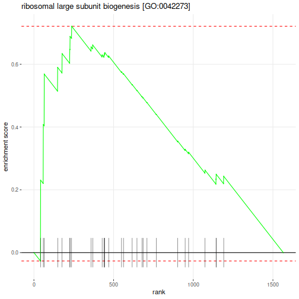

# isobaric-prot-wf-r
## Simple workflow for isobaric-labeling proteomic data with ANOVA, t-testing, DEqMS/limma and annotation via fgsea

The author recommends [RStudio IDE](https://www.rstudio.com/). The script was developed and tested on Ubuntu 20.04 with R 3.6.<br>
Usage:
* Download and run the ".R" script, adapting the paths and formats
* Pay particular attention to the format of the output file and to sample names. The example table has the quantitative data in "Abundance Ratio" columns, the biological replicates from the same group are named *xyz_1*, *xyz_2*, *xyz_3*.
* 
See the main highlights of the workflows below:
```r
#library(readxl)
library(dplyr)
library(ggplot2)
library(tidyr)
library(DEqMS)
library(fgsea)
```
Select the work directory and import the protein table.
<br>The example data originates from the analysis of the commercial yeast [triple-knockout (TKO) TMT standard](https://www.thermofisher.com/order/catalog/product/A40938#/A40938)
<br>LC-MS rw files were processed via [Proteome Discoverer 2.4](https://www.thermofisher.com/order/catalog/product/OPTON-30812?ce=E.21CMD.DL107.39848.01&cid=E.21CMD.DL107.39848.01&ef_id=EAIaIQobChMIia_rv4-u8wIVAq-yCh2J3wI6EAAYASAAEgLKhfD_BwE:G:s&s_kwcid=AL!3652!3!334040549172!e!!g!!proteome%20discoverer#/OPTON-30812?ce=E.21CMD.DL107.39848.01&cid=E.21CMD.DL107.39848.01&ef_id=EAIaIQobChMIia_rv4-u8wIVAq-yCh2J3wI6EAAYASAAEgLKhfD_BwE:G:s&s_kwcid=AL!3652!3!334040549172!e!!g!!proteome%20discoverer), the output files were saved as tab-separated text file with "R-friendly header" set to "True".

```r
#Set the working directory for the project
setwd("/home/trainee/Documents/R/Yeast_TKO/")
#If the table has been exported as a tab-separated text file
all_proteins <- read.table("MS3_FAIMS_Proteins_PD24.txt", sep = '\t', header = TRUE)
#If the table is in Excel format
#all_proteins <- read_excel("MS3_FAIMS_Proteins_PD24.xlsx")
```

```r
dim(all_proteins)
```

```
## [1] 1904   51
```

The quantitative columns (abundance ratio columns) are extracted and renamed:
```r
res <- rename_ratios(all_proteins)
all_proteins <- res[[1]]
quan_columns <- res[[2]]
quan_columns
```

```
##  [1] "BY4741_2" "his4_1"   "his4_2"   "his4_3"   "met6_1"   "met6_2"   "met6_3"   "ura2_1"   "ura2_2"   "ura2_3"
```

After several stages of filtering, we check the abundance distibution in each sample:

```r
dfWide <- all_proteins %>%
  filter(!grepl("cont_",Accession)) %>%
  subset (select=c("Accession", quan_columns) ) %>%
  na.omit()

rownames(dfWide) <- dfWide$Accession
dfWide$Accession <- NULL
dfWide <- log2(dfWide)
#Look at the distribution of quan values
summary(dfWide)
```

```
##     BY4741_2            his4_1              his4_2              his4_3              met6_1        
##  Min.   :-0.76121   Min.   :-2.426625   Min.   :-2.343732   Min.   :-2.434403   Min.   :-3.36587  
##  1st Qu.:-0.08161   1st Qu.:-0.189351   1st Qu.:-0.193058   1st Qu.:-0.195946   1st Qu.:-0.23447  
##  Median :-0.01013   Median :-0.020340   Median :-0.014500   Median :-0.017417   Median :-0.08238  
##  Mean   :-0.01831   Mean   : 0.005853   Mean   : 0.003676   Mean   : 0.000839   Mean   :-0.06536  
##  3rd Qu.: 0.04963   3rd Qu.: 0.180148   3rd Qu.: 0.186501   3rd Qu.: 0.180148   3rd Qu.: 0.09390  
##  Max.   : 0.76043   Max.   : 3.528321   Max.   : 3.441218   Max.   : 3.478195   Max.   : 1.84679  
##      met6_2             met6_3             ura2_1             ura2_2             ura2_3        
##  Min.   :-3.15843   Min.   :-3.26534   Min.   :-2.49005   Min.   :-2.57347   Min.   :-2.44222  
##  1st Qu.:-0.20257   1st Qu.:-0.22600   1st Qu.:-0.18033   1st Qu.:-0.18115   1st Qu.:-0.16974  
##  Median :-0.06492   Median :-0.07704   Median :-0.03579   Median :-0.04097   Median :-0.03357  
##  Mean   :-0.04076   Mean   :-0.05791   Mean   :-0.02990   Mean   :-0.03511   Mean   :-0.02894  
##  3rd Qu.: 0.10467   3rd Qu.: 0.09119   3rd Qu.: 0.12433   3rd Qu.: 0.11636   3rd Qu.: 0.10836  
##  Max.   : 1.68840   Max.   : 1.79119   Max.   : 2.07108   Max.   : 1.61259   Max.   : 1.92828
```

```r
#Box Plot
boxplot(
  Log2_Abund~Sample, data = gather(dfWide, Sample, Log2_Abund),
  main = "Original Log2 Ratios"
  )
```


Proteomic data may require normalization. Let's normalize each sample on it's median and check out the resulting distributions:

```r
#For each column, subtract the median of the column from each of it's values
dfNorm <- mapply('-', dfWide, apply(dfWide,2,median))
#Transform into a dataframe
dfNorm <- as.data.frame(dfNorm, row.names = row.names(dfWide))
boxplot(
  Log2_Abund~Sample, data = gather(dfNorm, Sample, Log2_Abund),
  main = "Normalized Log2 Ratios"
  )
```


```r
#If desired, use the normalized data for the downstream operations
dfWide <- dfNorm
dfWide$Accession <- row.names(dfWide)
dfLong <- gather(dfWide, Sample, Log2_Abund, -Accession)
dfWide$Accession <- NULL
```


Look at the principle component analysis on samples:
```r
dfWide.t <-  t(dfWide)
dfWide.pca <- prcomp(dfWide.t, center = TRUE, scale. = FALSE)
summary(dfWide.pca)
```

```
## Importance of components:
##                           PC1    PC2    PC3     PC4     PC5     PC6     PC7     PC8     PC9      PC10
## Standard deviation     4.7762 3.8970 2.8019 1.78159 1.61259 1.53323 1.51155 1.40213 1.36160 2.443e-15
## Proportion of Variance 0.3797 0.2528 0.1307 0.05283 0.04328 0.03913 0.03803 0.03272 0.03086 0.000e+00
## Cumulative Proportion  0.3797 0.6325 0.7631 0.81598 0.85926 0.89839 0.93642 0.96914 1.00000 1.000e+00
```

Let's plot the first 4 principal components, as they explain the bulk of the variation within the data set:

```r
dfWide.pca <- as.data.frame(dfWide.pca$x)
dfWide.pca$Group <- sapply(
  as.character( row.names(dfWide.pca) ),
  function(x) {
    strsplit(x, "_")[[1]][[1]]
  }
)
#Principal components 1 and 2
ggplot(
  dfWide.pca,
  aes(x = PC1, y = PC2, colour = Group )
  ) +
  geom_point(shape=19, size=4, alpha = 0.7)+
  geom_hline(yintercept = 0, colour = "gray65") +
  geom_vline(xintercept = 0, colour = "gray65") +
  ggtitle("PCA On Proteins") +
  theme_classic()
```


```r
#Principal components 3 and 4
ggplot(
  dfWide.pca,
  aes(x = PC3, y = PC4, colour = Group )
) +
  geom_point(shape=19, size=4, alpha = 0.7)+
  geom_hline(yintercept = 0, colour = "gray65") +
  geom_vline(xintercept = 0, colour = "gray65") +
  ggtitle("PCA On Proteins") +
  theme_classic()
```


One-way ANOVA analysis:
```r
cols_anova <- c("his4_1", "his4_2", "his4_3", "met6_1", "met6_2", "met6_3", "ura2_1", "ura2_2", "ura2_3")
#Create the named list with our groups
groups <- list()
for (i in cols_anova) {
  local_name <- strsplit(i, "_")[[1]][[1]]
  if ( local_name %in% names(groups) ) {
    groups[[local_name]] <- c(groups[[local_name]], i)
  } else {
    groups[[local_name]] <- c(i)
  }
}
groups
```

```
## $his4
## [1] "his4_1" "his4_2" "his4_3"
## 
## $met6
## [1] "met6_1" "met6_2" "met6_3"
## 
## $ura2
## [1] "ura2_1" "ura2_2" "ura2_3"
```

```r
dfANOVA <- dfWide
dfANOVA$anovaPval <- apply(dfANOVA, 1, function(x) {
  df <- as.data.frame(x)
  #Select the samples for ANOVA
  #Important if you need to exclude some of the samples from the calculation
  #cols_anova <- c("his4_1", "his4_2", "his4_3", "met6_1", "met6_2", "met6_3", "ura2_1", "ura2_2", "ura2_3")
  df$Sample <- rownames(df)
  df <- df[ df$Sample %in% cols_anova, ]
  
  #Define groups in sync with the selected columns
  #OBS: format-dependent
  df$Group <- as.vector(
    sapply(
      cols_anova,
      function(x) { strsplit(x, "_")[[1]][[1]] }
      )
    )
  anovaResults <- aov(x ~ Group, data = df)
  #This Very exciting expression is how to extract the p-value from the aov summary
  return(summary(anovaResults)[[1]]["Pr(>F)"][[1]][[1]])
})
#Benjamini-Hochberg correction for multiple testing
dfANOVA$adjPval <- p.adjust(dfANOVA$anovaPval, method = "BH")
#Add group averages
for ( i in names(groups) ) {
  dfANOVA[i] <- apply(
    dfANOVA, 1, function(x) {
      #print(x)
      #print(typeof(x))
      mean( x[ groups[[i]] ] )
    }
  )
}
#Add max LogFC
dfANOVA$MaxLog2FC <- apply(
  dfANOVA, 1, function(x) {
    log_means <- x[ names(groups) ]
    max(log_means) - min(log_means)
  }
)
```


Select proteins with adjusted ANOVA P <= 0.05 and FC > log2(1.3) (30%)

```r
dfANOVA.Sign <- dfANOVA %>%
  filter(adjPval <= 0.05 & MaxLog2FC >= log2(1.3) ) %>%
  select(cols_anova)
dim(dfANOVA.Sign)
```

```
## [1] 190  9
```

```r
heatmap(
  as.matrix( dfANOVA.Sign ), scale = "none",
  col = colorRampPalette(c("red", "grey", "blue"))(256)
)
```


The classic way to compare levels in two groups is the Student's t-test.<br>
Let's compare the *met6* knockouts and *his4* knockouts as an example:
```r
calc_ttest <- function(df, groupping, gr1, gr2, maxAdjP, minFC) {
  df <- df[ c( groupping[[gr1]], groupping[[gr2]]  ) ]
  #Log2 fold change group2 - group1
  df$Log2FC <- apply(
    df, 1, function(x) {
      mean( x[ groupping[[gr2]] ] ) - mean( x[ groupping[[gr1]] ] )
    }
  )
  #T-test with equal variance
  df$T_Pval <- apply(
    df, 1, function(x) {
      res <- t.test(
        x[ groupping[[gr2]] ], x[ groupping[[gr1]] ],
        alternative = "two.sided", var.equal = TRUE
        )
      mean( x[ groupping[[gr2]] ] ) - mean( x[ groupping[[gr1]] ] )
      res$p.value
    }
  )
  #Benjamini-Hochberg correction for multiple testing
  df$adjPval <- p.adjust(df$T_Pval, method = "BH")
  df$Log10adjPval <- -1*log10(df$adjPval)
  #Add the categorical column
  df$Diff_Abund <- apply(
    df, 1, function(x) {
      if (x[["adjPval"]] <= maxAdjP & x[["Log2FC"]] >= minFC) {
        return( paste("Up in", gr2) )
      } else if (x[["adjPval"]] <= maxAdjP & x[["Log2FC"]] <= -1*minFC) {
        return( paste("Up in", gr1) )
      } else {
        return('Non-significant')
      }
    }
  )
  df
}
maxAdjP <- 0.05
minLog2FC <- round(log2(1.3), 3)
gr1 <- "met6"
gr2 <- "his4"
dfTtest <- calc_ttest(dfWide, groups, gr1, gr2, maxAdjP, minLog2FC )
#How many proteins have adj. P <= 0.05?
dim( filter(dfTtest, adjPval <= maxAdjP) )
```
```
## [1] 493  11
```
Let's ad the minimal fold change to concentrate on the strongest significant effects.<br>
There were 116 proteins that pass the filtering criteria:
```r
dim(dfTtest %>%
      filter(adjPval <= maxAdjP) %>%
      filter( Log2FC >= minLog2FC | Log2FC <= -1*minLog2FC ))
```

```
## [1] 116  11
```

Volcano plot for the met6-his4 comparison:
```r
#Add columns with the gene names and other info
dfTtest <- merge(
  dfTtest, all_proteins,
  by.x="row.names", by.y="Accession",
  suffixes=c("", "_"), sort=FALSE
  )

#Volcano plot
ggplot(
  dfTtest,
  aes(x = Log2FC, y = Log10adjPval, colour = Diff_Abund )
) +
  geom_point(shape=19, size=2, alpha = 0.6)+
  geom_hline(yintercept = -1*log10(maxAdjP), colour = "gray65") +
  geom_vline(xintercept = 0, colour = "gray65") +
  geom_vline(xintercept = -1*minLog2FC, colour = "gray65") +
  geom_vline(xintercept = minLog2FC, colour = "gray65") +
  ggtitle(
    paste(
      "T-test ", gr1, " vs ", gr2,
      " Adjusted P-value<=", maxAdjP, " Log2 FC>=", minLog2FC,
      sep=""
      )
    ) +
  theme_classic() +
  theme(
    legend.title = element_blank(), legend.text = element_text(size=12),
    plot.title = element_text(size=16)
    ) +
  labs(x = paste("Log2 FC", gr2, "-", gr1), y = "-Log10 Adj. P-value" ) +
  geom_text(
    data = subset(dfTtest, Log2FC >=0.9 | Log2FC <= -0.8),
    aes( Log2FC, Log10adjPval, label = Gene),
    alpha = 0.6, hjust = 0.5, vjust = -0.6
    )
```


[DEqMS](https://www.bioconductor.org/packages/release/bioc/html/DEqMS.html) is an R package for differential expression analysis that have been developped specifically for proteomic data by Yafeng Zhu in Janne Lehtiö's lab in Stockholm. The algorithm estimates the protein variance based on the number of peptides or PSMs, claiming better accuracy in detecting differences in protein levels, see [the open-access MCP article](https://www.mcponline.org/article/S1535-9476(20)34997-5/fulltext) for details. DEqMS builds on the widely used [limma package](https://bioconductor.org/packages/release/bioc/html/limma.html), p-value and BH-adjusted p-value from limma are reported as a bonus, alongside the spectra count adjusted posterior p-values and BH-adjusted p-values calculated by DEqMS.<br>
Let's apply the algorithm to the TKO data:

```r
dfD <- dfWide[cols_anova]
#Define the design vector
cond = as.factor(
  c("his4", "his4", "his4", "met6", "met6", "met6", "ura2", "ura2", "ura2")
)
design = model.matrix(~0+cond)
colnames(design) = gsub("cond","",colnames(design))
#Make contrasts
x <- c(
  "his4-met6", "his4-ura2", "ura2-met6" 
  )
contrast =  makeContrasts(contrasts=x,levels=design)
fit1 <- lmFit(dfD, design)
fit2 <- contrasts.fit(fit1,contrasts = contrast)
fit3 <- eBayes(fit2)
#Extract PSM count information
psm_count_table <- dfD %>%
  merge(
    all_proteins[c("Accession", "Number.of.PSMs")],
    by.x="row.names", by.y="Accession",  suffixes=c("", "_"), sort=FALSE
    )
row.names(psm_count_table) <- psm_count_table$Row.names
psm_count_table <- psm_count_table[c("Number.of.PSMs")]
fit3$count = psm_count_table[rownames(fit3$coefficients),"Number.of.PSMs"]
fit4 = spectraCounteBayes(fit3)
```

The data-dependent variance distribution looks as follows:
```r
VarianceBoxplot(
  fit4, n=30, main="TKO Variance according to DEqMS", xlab="PSM count"
  )
```


Let's look at the contrast ura2-met6, column number 3:

```r
current_contrast <- colnames(fit4$coefficients)[[1]]
res_DEqMS = outputResult(fit4, coef_col = 1)
head(res_DEqMS)
```

```
##             logFC     AveExpr         t      P.Value    adj.P.Val        B   gene count      sca.t
## P00815 -2.8532509 -0.54962113 -85.67738 8.428621e-13 1.318236e-09 18.82971 P00815    20 -108.89141
## P05694  3.5999485 -0.85859918  77.41234 1.846004e-12 1.443575e-09 18.37417 P05694    30   96.37396
## P37291 -0.6922910  0.40048261 -28.07419 4.585032e-09 1.434198e-06 11.77468 P37291    36  -42.07175
## P15992 -0.6353142  0.44930312 -27.22447 5.803328e-09 1.512734e-06 11.53513 P15992    18  -36.62270
## P39954 -0.5661252  0.01364542 -22.95737 2.138660e-08 3.344865e-06 10.18583 P39954    22  -31.96714
## Q12443 -1.2662064  0.60896317 -44.48587 1.329146e-10 6.929282e-08 15.15264 Q12443     4  -30.06690
##         sca.P.Value sca.adj.pval
## P00815 8.998668e-18 1.407392e-14
## P05694 3.360470e-17 2.627888e-14
## P37291 2.531791e-13 1.319907e-10
## P15992 1.121588e-12 4.385408e-10
## P39954 4.810014e-12 1.504572e-09
## Q12443 9.260675e-12 2.413949e-09
```
Add negative log10-transfromed adjusted p-values for plotting:

```r
res_DEqMS$log.adj.P.Val  = -log10(res_DEqMS$adj.P.Val )
res_DEqMS$log.sca.adj.pval = -log10(res_DEqMS$sca.adj.pval)
```
How many proteins have adj. P <= 0.05 according to LIMMA?
```r
maxAdjP <- 0.05
minLog2FC <- round(log2(1.3), 3)
dim(
  filter(res_DEqMS, adj.P.Val <= maxAdjP)
)
```

```
## [1] 611  13
```
How many proteins have adj. P <= 0.05 and Log2 FC >= log2(1.3) [30%] according to LIMMA?
```r
dim(res_DEqMS %>%
      filter(adj.P.Val <= maxAdjP) %>%
      filter( logFC >= minLog2FC | logFC <= -1*minLog2FC ))
```

```
## [1] 148  13
```
How many proteins have adj. P <= 0.05 according to DEqMS?
```r
dim(
  filter(res_DEqMS, sca.adj.pval <= maxAdjP)
)
```

```
## [1] 645  13
```
How many proteins have adj. P <= 0.05 and Log2 FC >= log2(1.3) [30%] according to DEqMS?
```r
dim(res_DEqMS %>%
      filter(sca.adj.pval <= maxAdjP) %>%
      filter( logFC >= minLog2FC | logFC <= -1*minLog2FC ))
```

```
## [1] 154  13
```

```r
gr1 <- strsplit(current_contrast, "-")[[1]][[2]]
gr2 <- strsplit(current_contrast, "-")[[1]][[1]]
#Add categorical annotation columns for LIMMA and DEqMS
res_DEqMS$Diff_LIMMA <- apply(
  res_DEqMS, 1, function(x) {
    local_p <- as.numeric(x[["adj.P.Val"]])
    local_fc <- as.numeric(x[["logFC"]])
    if (local_p <= maxAdjP & local_fc >= minLog2FC) {
      return( paste("Up in", gr2) )
    } else if (local_p <= maxAdjP & local_fc <= -1*minLog2FC) {
      return( paste("Up in", gr1) )
    } else {
      return('Non-significant')
    }
  }
)
res_DEqMS$Diff_DEqMS <- apply(
  res_DEqMS, 1, function(x) {
    local_p <- as.numeric(x[["sca.adj.pval"]])
    local_fc <- as.numeric(x[["logFC"]])
    if (local_p <= maxAdjP & local_fc >= minLog2FC) {
      return( paste("Up in", gr2) )
    } else if (local_p <= maxAdjP & local_fc <= -1*minLog2FC) {
      return( paste("Up in", gr1) )
    } else {
      return('Non-significant')
    }
  }
)
```

Volcano plot for LIMMA
```r
ggplot(
  res_DEqMS,
  aes(x = logFC, y = log.adj.P.Val, colour = Diff_LIMMA )
) +
  geom_point(shape=19, size=2, alpha = 0.6)+
  geom_hline(yintercept = -1*log10(maxAdjP), colour = "gray65") +
  geom_vline(xintercept = 0, colour = "gray65") +
  geom_vline(xintercept = -1*minLog2FC, colour = "gray65") +
  geom_vline(xintercept = minLog2FC, colour = "gray65") +
  ggtitle(
    paste(
      "LIMMA ", current_contrast,
      " Adjusted P-value<=", maxAdjP, " Log2 FC>=", minLog2FC,
      sep=""
    )
  ) +
  theme_classic() +
  theme(
    legend.title = element_blank(), legend.text = element_text(size=12),
    plot.title = element_text(size=16)
  ) +
  labs(x = paste("Log2 FC",current_contrast), y = "-Log10 Adj. P-value" ) +
  geom_text(
    data = subset(res_DEqMS, logFC >=1.0 | logFC <= -0.8),
    aes( logFC, log.adj.P.Val, label = Gene),
    alpha = 0.6, hjust = 0.5, vjust = -0.6
  )
```


Volcano plot for DEqMS
```r
ggplot(
  res_DEqMS,
  aes(x = logFC, y = log.sca.adj.pval, colour = Diff_DEqMS )
) +
  geom_point(shape=19, size=2, alpha = 0.6)+
  geom_hline(yintercept = -1*log10(maxAdjP), colour = "gray65") +
  geom_vline(xintercept = 0, colour = "gray65") +
  geom_vline(xintercept = -1*minLog2FC, colour = "gray65") +
  geom_vline(xintercept = minLog2FC, colour = "gray65") +
  ggtitle(
    paste(
      "DEqMS ", current_contrast,
      " Adjusted P-value<=", maxAdjP, " Log2 FC>=", minLog2FC,
      sep=""
    )
  ) +
  theme_classic() +
  theme(
    legend.title = element_blank(), legend.text = element_text(size=12),
    plot.title = element_text(size=16)
  ) +
  labs(x = paste("Log2 FC",current_contrast), y = "-Log10 Adj. P-value" ) +
  geom_text(
    data = subset(res_DEqMS, logFC >=0.9 | logFC <= -0.8),
    aes( logFC, log.sca.adj.pval, label = Gene),
    alpha = 0.6, hjust = 0.5, vjust = -0.6
  )
```


Furthermore, gene set enrichment using [fgsea package](http://bioconductor.org/packages/release/bioc/html/fgsea.html) can be employed for basic functional annotation.<br>
I downloaded the Gene Ontology annotations for yeast from [Uniprot](https://www.uniprot.org/proteomes/UP000002311), with gene names as identifiers. GO Consortium data is available under [Creative Commons Attribution 4.0 Unported License](https://creativecommons.org/licenses/by/4.0/legalcode). Let's use the GO Biological Process as an example, the gmt file can be found in this repository as well:

```r
annotations <- gmtPathways("go-bp_gene-symbols_uniprot.gmt")

#Prepare the rank file for the ura2-met6 contrast
#Replace the UNIPROT accession with the Gene name
dfGSEA <- res_DEqMS[c("Gene", "logFC", "log.sca.adj.pval")]
```
Use the product (Log2FC * -Log10(adj.P.val.SCA)) to rank genes in the table:
```r
dfGSEA$rank <- apply(
  dfGSEA, 1, function(x) {
    as.numeric(x[[2]]) * as.numeric(x[[3]])
  }
)

ranks <- as.numeric(dfGSEA$rank)
names(ranks) <- dfGSEA$Gene
ranks <- sort(ranks)
ranks[1:10]
```

```
##       HIS4       RTN2      SIP18      HSP12       GCV2       SHM2      HSP26       SAM1       SAH1       GPH1 
## -39.522063 -10.911242  -8.174439  -7.404254  -6.980468  -6.839459  -5.945264  -5.255033  -4.994689  -4.869912
```

Run fgsea and go with the default settings for enrichment:
```r
res_gsea <- fgseaMultilevel(annotations, ranks, minSize=15, maxSize=500)
head(res_gsea)
```

```
##                                        pathway      pval      padj    log2err         ES        NES size
## 1:                     DNA repair [GO:0006281] 0.5493827 0.9792398 0.07569463  0.4890924  0.9355784   20
## 2:    actin filament organization [GO:0007015] 0.9277344 0.9939024 0.04802204 -0.3478877 -0.6806408   21
## 3:            aerobic respiration [GO:0009060] 0.4152893 0.9675056 0.09110731  0.5546527  1.0388591   18
## 4: carbohydrate metabolic process [GO:0005975] 0.7070312 0.9792398 0.06064040 -0.4277279 -0.8368478   21
## 5:                     cell cycle [GO:0007049] 0.8966942 0.9939024 0.05216303  0.3572035  0.6690387   18
## 6:                  cell division [GO:0051301] 0.2551440 0.9181034 0.12154328  0.6158352  1.1780231   20
##                            leadingEdge
## 1: HRT1,BDF1,HTA2,RFA2,MGM101,MLP1,...
## 2:                      ENT2,SAC6,RHO1
## 3:     RIB1,MIX14,RIB3,QCR7,MIX17,RIP1
## 4:   PGM2,CIT1,GPD1,GLC3,TAL1,MDH1,...
## 5:                     CDC25,BNI5,NSP1
## 6:                     HRT1,CDC25,UBC9
```

Ten pathways with the largest positive enrichment scores:
```r
res_gsea[ES > 0][head(order(pval), n=10),]
```

```
##                                                                                                   pathway       pval
##  1: maturation of LSU-rRNA from tricistronic rRNA transcript (SSU-rRNA, 5.8S rRNA, LSU-rRNA) [GO:0000463] 0.05785124
##  2:                                                                     chromatin remodeling [GO:0006338] 0.06918239
##  3:                                                       ribosomal large subunit biogenesis [GO:0042273] 0.07171315
##  4:                                                       fungal-type cell wall organization [GO:0031505] 0.07370518
##  5:                                                       transcription by RNA polymerase II [GO:0006366] 0.08176101
##  6:                                negative regulation of transcription by RNA polymerase II [GO:0000122] 0.10062893
##  7:                                         regulation of transcription by RNA polymerase II [GO:0006357] 0.17283951
##  8:                                                                      ribosome biogenesis [GO:0042254] 0.19591837
##  9:                                positive regulation of transcription by RNA polymerase II [GO:0045944] 0.24696356
## 10:                                                                            cell division [GO:0051301] 0.25514403
##          padj   log2err        ES      NES size                            leadingEdge
##  1: 0.4832041 0.2712886 0.7913647 1.482218   18              NOP2,NOP12,CIC1,TIF6,RPF2
##  2: 0.4832041 0.2489111 0.7765741 1.440644   17     CHZ1,CBF1,HTZ1,TAF14,BDF1,CYC8,...
##  3: 0.4832041 0.2377938 0.7208805 1.497722   30 NOP2,RPL26A,RPL26B,TIF6,MAK21,REH1,...
##  4: 0.4832041 0.2343926 0.6997807 1.462006   31      CIS3,ZEO1,BAR1,BGL2,EXG1,CRH1,...
##  5: 0.4832041 0.2279872 0.7579933 1.400889   16    RPC10,RPB9,TAF14,BUR6,TFA1,RPB3,...
##  6: 0.5132075 0.2042948 0.7395614 1.366824   16     PAF1,RPA12,CBF1,BUR6,ESS1,RAP1,...
##  7: 0.8013468 0.1511488 0.6526132 1.248375   20      PAF1,CBF1,SPN1,HTZ1,TUP1,CYC8,...
##  8: 0.8326531 0.1404062 0.6386159 1.241881   21         RPC10,RPA14,RPA12,RPL40A,RPC19
##  9: 0.9181034 0.1226792 0.5842056 1.187375   26      KAE1,CBF1,BUR6,ESS1,RAP1,TUP1,...
## 10: 0.9181034 0.1215433 0.6158352 1.178023   20                        HRT1,CDC25,UBC9
```

Ten pathways with the largest negative enrichment scores:
```r
res_gsea[ES < 0][head(order(pval), n=10),]
```

```
##                                                                                pathway        pval      padj    log2err
##  1:                                purine nucleotide biosynthetic process [GO:0006164] 0.006649502 0.3391246 0.40701792
##  2:                                 cellular response to oxidative stress [GO:0034599] 0.040935673 0.4832041 0.31532483
##  3:                                       ergosterol biosynthetic process [GO:0006696] 0.041904762 0.4832041 0.30775005
##  4:                                                    glycolytic process [GO:0006096] 0.085271318 0.4832041 0.21392786
##  5: retrograde vesicle-mediated transport, Golgi to endoplasmic reticulum [GO:0006890] 0.535019455 0.9792398 0.07417590
##  6:                                                           endocytosis [GO:0006897] 0.543859649 0.9792398 0.07343814
##  7:                                                           translation [GO:0006412] 0.609523810 0.9792398 0.06658921
##  8:                                      ribosomal large subunit assembly [GO:0000027] 0.705426357 0.9792398 0.06037864
##  9:                                        carbohydrate metabolic process [GO:0005975] 0.707031250 0.9792398 0.06064040
## 10:                                                       rRNA processing [GO:0006364] 0.727626459 0.9792398 0.05909548
##             ES        NES size                        leadingEdge
##  1: -0.8517795 -1.5621756   15 MTD1,ADE17,ADE4,ADE2,ADE6,ADE8,...
##  2: -0.6998521 -1.5312424   39 HSP12,ACT1,TPS1,GAD1,YHB1,MCR1,...
##  3: -0.7858271 -1.4633302   16        ERG27,ERG13,MCR1,ERG20,ERG9
##  4: -0.7048514 -1.3727129   20 HXK1,GLK1,CDC19,TDH1,PFK2,PGI1,...
##  5: -0.5006317 -0.9619512   19    RER1,YPT1,SEC21,COP1,GET3,ERV46
##  6: -0.4312358 -0.9435230   39                ACT1,CHC1,ENT2,DNF1
##  7: -0.4857894 -0.9046142   16                             RPL24B
##  8: -0.4277358 -0.8330244   20                        RPL24B,RPL3
##  9: -0.4277279 -0.8368478   21  PGM2,CIT1,GPD1,GLC3,TAL1,MDH1,...
```
Let's look at one of the pathways from the top with positive enrichment scores:
```r
plotEnrichment(
  annotations[["ribosomal large subunit biogenesis [GO:0042273]"]],
  ranks
) + labs(title="ribosomal large subunit biogenesis [GO:0042273]")
```



```r
annotations[["ribosomal large subunit biogenesis [GO:0042273]"]]
```

```
##  [1] "ACL4"    "AFG2"    "ALB1"    "EBP2"    "ERB1"    "HAS1"    "HRR25"   "JIP5"    "JJJ1"    "LOC1"    "MAK11"   "MAK16"  
## [13] "MAK21"   "MAK5"    "MRT4"    "NIP7"    "NOC2"    "NOC3"    "NOG1"    "NOP15"   "NOP16"   "NOP2"    "NOP4"    "NOP7"   
## [25] "NOP8"    "NSA1"    "NSA2"    "PRP43"   "PUF6"    "REH1"    "REI1"    "RIX7"    "RLI1"    "RLP24"   "RLP7"    "RPL14A" 
## [37] "RPL14B"  "RPL26A"  "RPL26B"  "RPL33A"  "RPL33B"  "RPL7A"   "RPL7B"   "RRP14"   "RRP8"    "RRS1"    "SDA1"    "SQT1"   
## [49] "SYO1"    "TIF4631" "TIF6"    "TRM112"  "YTM1"
```

And at one of the pathways from the top with negative enrichment scores:
```r
plotEnrichment(
  annotations[["purine nucleotide biosynthetic process [GO:0006164]"]],
  ranks
) + labs(title="purine nucleotide biosynthetic process [GO:0006164]")
```


```r
annotations[["purine nucleotide biosynthetic process [GO:0006164]"]]
```

```
##  [1] "ADE1"   "ADE12"  "ADE13"  "ADE16"  "ADE17"  "ADE2"   "ADE3"   "ADE4"   "ADE5,7" "ADE6"   "ADE8"   "MIS1"   "MTD1"  
## [14] "PRS1"   "PRS2"   "PRS3"   "PRS4"   "PRS5"
```


